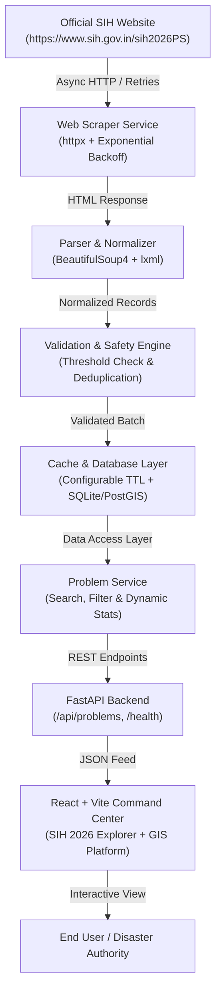

# SurakshitSthan AI — SIH 2026 Live Web Scraping & Multi-Hazard Platform


SurakshitSthan AI is a government-grade geospatial intelligence and AI decision-support platform designed for Smart India Hackathon 2026, equipped with a **production-ready live web-scraping pipeline** that extracts problem statements directly from the official Smart India Hackathon portal (`https://www.sih.gov.in/sih2026PS`).

---

## 🏗️ System Architecture



---

## 🌐 SIH 2026 Live Scraping Pipeline

The application features a dedicated scraping service with zero reliance on static/hardcoded problem statement datasets:

1. **Official Source Target**: Dynamically targets the official portal (`SIH_SOURCE_URL=https://www.sih.gov.in/sih2026PS`).
2. **Resilient Parser (`backend/app/scraper/parser.py`)**:
   - Inspects semantic table headers, rows, inner modal dialogs, and embedded metadata.
   - Extracts `Problem ID`, `Serial No`, `Title`, `Organization`, `Department`, `Category` (`Software`/`Hardware`), `Theme`, `Description`, `Background`, `Expected Solution`, `Deadline`, `Submitted Ideas Count`, and `Reference Links`.
3. **Data Normalization & Sanitization (`backend/app/scraper/normalizer.py`)**:
   - Cleans unicode artifacts, decodes HTML entities (`&amp;`, `&nbsp;`, etc.), normalizes line breaks, and deduplicates records by retaining the version with highest completeness.
4. **Safety & Validation Engine (`backend/app/scraper/validator.py`)**:
   - Enforces field constraints and ID formats.
   - **Safety Threshold Check**: If an upstream failure causes a drastic drop in discovered records, the system rejects the batch and retains the previous valid cache.
5. **Thread-Safe Caching (`backend/app/scraper/cache.py`)**:
   - Configurable TTL (`CACHE_TTL_MINUTES=60`).
   - Tracks cache age, status (`success`, `scraping`, `failed`), and source metadata.

---

## 📡 REST API Endpoints

| Method | Endpoint | Description |
| :--- | :--- | :--- |
| `GET` | `/health` | System health check (API, Scraper availability, DB connection) |
| `GET` | `/api/problems` | List all available problem statements with optional filters |
| `GET` | `/api/problems/{id}` | Retrieve a single problem statement by ID (e.g., `SIH26001`) |
| `GET` | `/api/problems/search?q=` | Full-text query search across title, description, org, theme, ID |
| `GET` | `/api/problems/filter` | Query filter by `category`, `theme`, `organization`, `sort_by` |
| `GET` | `/api/problems/stats` | Dynamic statistical metrics (Total count, Software/Hardware, Themes) |
| `GET` | `/api/scraper/status` | Current scraper operational status, cache age, source URL |
| `POST` | `/api/scraper/refresh` | Force manual refresh against the official SIH portal |

---

## ⚙️ Environment Variables Configuration

Configure your `.env` in `backend/.env`:

```env
PROJECT_NAME="SurakshitSthan AI"
SECRET_KEY="surakshitsthan-super-secret-jwt-key"
DATABASE_URL="sqlite:///./surakshitsthan.db"
ENVIRONMENT="development"
DEMO_MODE=False

# SIH 2026 Live Web Scraper Settings
SIH_SOURCE_URL="https://www.sih.gov.in/sih2026PS"
CACHE_TTL_MINUTES=60
SCRAPER_USER_AGENT="Mozilla/5.0 (Windows NT 10.0; Win64; x64) AppleWebKit/537.36 SurakshitSthan-AI-Scraper/2.4.0"
SCRAPER_TIMEOUT_SECONDS=25
SCRAPER_MAX_RETRIES=3
```

---

## 🚀 Quick Start & Local Execution

### 1. Backend Setup (FastAPI + Scraper)
```bash
cd backend
pip install -r requirements.txt
python -m uvicorn app.main:app --host 0.0.0.0 --port 8000 --reload
```
* Interactive API Documentation: `http://localhost:8000/docs`
* Health Check: `http://localhost:8000/health`
* Scraper Status: `http://localhost:8000/api/scraper/status`

### 2. Frontend Setup (React 18 + Vite)
```bash
cd frontend
npm install
npm run dev
```
* Web Application: `http://localhost:3000` (or `http://localhost:5173`)

---

## 🧪 Automated Testing

Execute the test suite covering the HTML parser, normalizer, validator, safety checks, cache fallbacks, and API routes:

```bash
cd backend
python -m pytest tests/
```

### Verified Test Cases:
- ✅ `test_parse_sih_html_fixture`: HTML table and modal parsing
- ✅ `test_extract_problem_ids`: ID pattern extraction (`SIH26001`, `SIH26002`, etc.)
- ✅ `test_text_cleaning_and_normalization`: Entity decoding, whitespace normalization
- ✅ `test_deduplication_prefers_complete_record`: Retaining highest completeness
- ✅ `test_validation_and_safety_checks`: Threshold drop protection
- ✅ `test_cache_fallback_behavior`: Retaining previous cache on network error
- ✅ `test_sih_api_endpoints`: Endpoints `/api/problems`, `/api/problems/{id}`, `/api/problems/search`, `/api/problems/filter`, `/api/problems/stats`, `/api/scraper/status`, `/health`

---

## 🛠️ Tech Stack

- **Frontend**: React 18, TypeScript, Vite, Tailwind CSS, Lucide Icons, Leaflet / React-Leaflet, Recharts, Redux Toolkit
- **Backend**: FastAPI, Pydantic v2, SQLAlchemy, Uvicorn
- **Scraping Engine**: BeautifulSoup4, lxml, httpx, asyncio
- **AI & Analytics**: Scikit-Learn Random Forest, Google Gemini 2.5 Flash
- **Geospatial Processing**: GeoPandas, Shapely, PostGIS / SQLite
