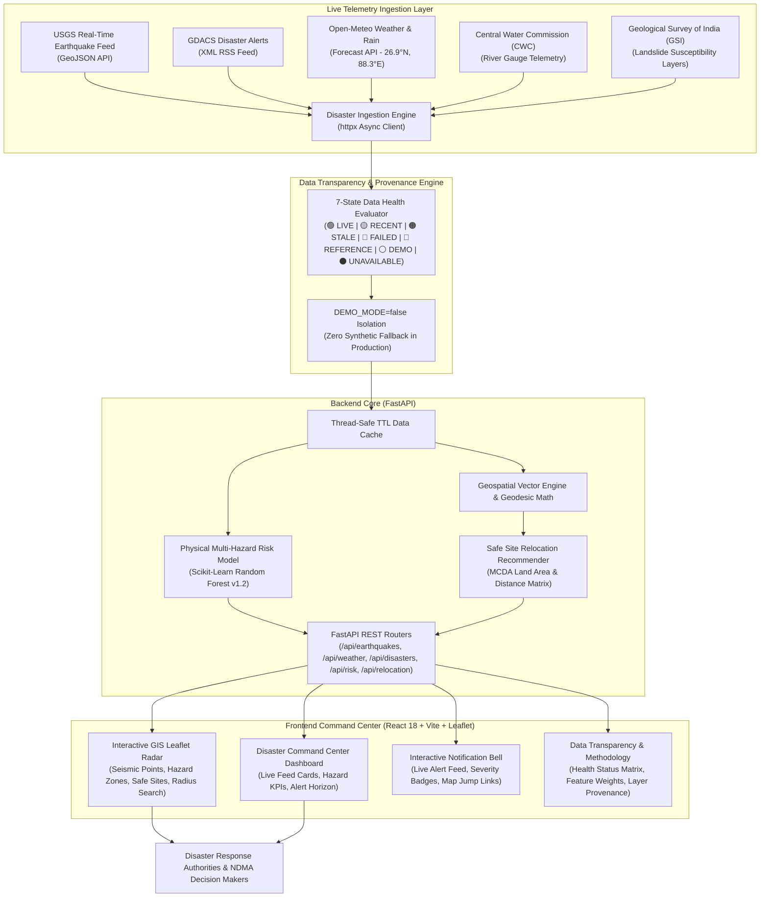

# SurakshitSthan AI — Real-Time Disaster Intelligence & GIS Decision-Support Platform


-7209b7?style=for-the-badge)
-4361ee?style=for-the-badge)

**SurakshitSthan AI** is an authoritative, transparent **Real-Time Disaster Intelligence & Geospatial Decision-Support Platform**. It provides live multi-hazard telemetry monitoring (USGS Earthquakes, GDACS Global Disaster Alerts, Open-Meteo Meteorological Telemetry, Central Water Commission River Gauges, and Geological Survey of India Landslide Susceptibility), an explainable Machine Learning multi-hazard risk engine, and Multi-Criteria Decision Analysis (MCDA) for safe relocation site selection.

The platform operates on a **strict 7-state data health engine**, fully transparent data provenance disclosures, and an isolated production configuration (`DEMO_MODE=false`) guaranteeing zero synthetic fallback data in production.

---

## 🏗️ System Architecture



---

## 🌟 Core Capabilities

### 1. Authoritative Real-Time Data Ingestion
* **USGS Earthquake Hazards Feed**: Real-time worldwide and Himalayan regional seismic events, Richter magnitude, focal depth, and geographic coordinates updated every minute.
* **GDACS Global Disaster Alerts**: XML RSS ingestion of cyclones, floods, tsunamis, and volcanic events with severity classification (Red, Orange, Green).
* **Open-Meteo Meteorological Telemetry**: Live temperature, relative humidity, wind speed, and precipitation observations for the Eastern Himalayas / Teesta River Basin (`26.9°N, 88.3°E`).
* **CWC River Gauge Telemetry**: River level monitoring across Teesta, Rangit, and Brahmaputra basins.
* **GSI Landslide Susceptibility**: High-resolution slope instability ratings and geological hazard polygons.

### 2. Strict 7-State Data Health Status Engine
Every data feed, layer, card, and endpoint is tagged with one of seven transparent operational states:

| Badge | State | Criteria & Cadence |
| :--- | :--- | :--- |
| `🟢 LIVE` | **Live Dynamic Feed** | Verified active feed fetched within the last 15 minutes |
| `🟡 RECENT` | **Recent Dynamic Feed** | Live feed fetched between 15 minutes and 6 hours ago |
| `🟠 STALE` | **Stale Dynamic Feed** | Data age between 6 hours and 24 hours |
| `🔴 FAILED` | **Upstream Outage** | Live feed unreachable, network timeout, or HTTP error |
| `🔵 REFERENCE` | **Official Static Layer** | Authoritative reference polygons (Survey of India state/district borders) |
| `⚪ DEMO` | **Simulation Mode** | Controlled synthetic test scenario (only active when `DEMO_MODE=true`) |
| `⚫ UNAVAILABLE` | **Sensor Offline** | Feed offline or monitoring telemetry unavailable |

### 3. Production Isolation (`DEMO_MODE=false`)
* Strict segregation between live production and demo testing.
* When `DEMO_MODE=false`, synthetic fallback datasets are strictly rejected.
* If an upstream API is unreachable, the system transparently marks the feed as `🔴 FAILED` or `⚫ UNAVAILABLE` rather than generating artificial data.

### 4. Physical Multi-Hazard Risk & Relocation Engine
* **Scikit-Learn Random Forest Model**:
  - Predicts habitation vulnerability scores and relocation urgency (`IMMEDIATE`, `SHORT_TERM`, `MEDIUM_TERM`, `MONITOR`).
  - Input features are strictly physical and infrastructural:
    - **Landslide Hazard Score** (35% weight)
    - **Flood & Inundation Hazard Score** (30% weight)
    - **Earthquake & Seismic Hazard Score** (20% weight)
    - **Environmental & Climate Degradation Score** (15% weight)
    - **Infrastructure Deficits & Evacuation Accessibility Barriers**
* **Multi-Criteria Safe Site Relocation Recommender**:
  - Evaluates candidate safe relocation sites across land parcel size, usable area (hectares), geological stability score, elevation difference, and evacuation road proximity.

### 5. Interactive GIS Leaflet Command Radar
* **Pan-India Vector Boundaries**: GeoJSON polygons for 28 States and 8 Union Territories.
* **Dynamic Map Layers**: Active seismic epicenters, flash flood zones, landslide susceptibility corridors, habitation markers, and verified safe relocation parcels.
* **Spatial Tools**: Radial buffer search (10 km – 100 km), coordinate search, interactive feature tooltips, and basemap switcher (Light Canvas, Satellite, Topographic).

### 6. Interactive Notification System
* Dynamic notification bell in the top navigation bar with unread counter and pulsing alert indicator.
* Displays live incoming seismic and disaster notices with severity tags (`Critical`, `Warning`, `Info`).
* Features **"Mark all read"**, alert dismissal, and one-click **"View GIS Location"** map jump links.

---

## 📡 REST API Reference

### Real-Time Disaster Feeds & Telemetry

| Method | Endpoint | Description |
| :--- | :--- | :--- |
| `GET` | `/api/earthquakes/live` | Live seismic events from USGS Earthquake Hazards Feed |
| `GET` | `/api/disasters/live` | Live multi-hazard alerts from GDACS XML RSS Feed |
| `GET` | `/api/weather/live?lat=26.9&lng=88.3` | Real-time meteorological telemetry from Open-Meteo API |
| `GET` | `/api/rainfall/live?lat=26.9&lng=88.3` | Live rainfall observations & trend analysis from Open-Meteo |
| `GET` | `/api/floods/live` | River gauge inundation telemetry from CWC |
| `GET` | `/api/landslides/live` | Slope instability and landslide alerts from GSI |

### Data Provenance & Health Status

| Method | Endpoint | Description |
| :--- | :--- | :--- |
| `GET` | `/api/data-sources` | Health status matrix for all upstream data feeds |
| `GET` | `/api/data-status` | System-wide data freshness summary & distribution |
| `GET` | `/api/data-freshness` | Per-source update timestamps and latency diagnostics |
| `GET` | `/api/gis/layers` | Catalog of authoritative vector layers and status tags |

### Risk Assessment, Relocation & Dashboard

| Method | Endpoint | Description |
| :--- | :--- | :--- |
| `GET` | `/api/dashboard/summary` | Executive command center KPIs, active hazard counts, and trends |
| `GET` | `/api/habitations` | Monitored habitations with physical hazard scores |
| `POST` | `/api/ml/predict` | Scikit-Learn Random Forest multi-hazard priority prediction |
| `GET` | `/api/risk/analyze/{id}` | Comprehensive hazard breakdown and vulnerability factors for a settlement |
| `GET` | `/api/sites` | Verified safe relocation sites with land area (ha) and safety ratings |
| `GET` | `/api/relocation/recommendations/{id}` | Ranked candidate safe relocation sites for a target habitation |
| `POST` | `/api/relocation/simulate` | Multi-site carrying capacity matching simulation across habitations |
| `GET` | `/api/reports/relocation` | Official state authority relocation brief with explainable AI rationale |

---

## 📁 Project Directory Structure

```text
SurakshitSthan AI/
├── backend/
│   ├── app/
│   │   ├── api/
│   │   │   ├── realtime_router.py     # Live USGS, GDACS, Open-Meteo & Data Health APIs
│   │   │   ├── dashboard_router.py    # Executive command center KPIs & summary metrics
│   │   │   ├── risk_router.py         # Multi-hazard risk analysis & weights configuration
│   │   │   ├── ml_router.py           # Scikit-Learn Random Forest prediction endpoints
│   │   │   ├── relocation_router.py   # AI safe site recommendation & capacity matching
│   │   │   ├── sites_router.py        # Verified safe relocation parcels & land capacity
│   │   │   ├── habitations_router.py  # Monitored settlements & hazard breakdowns
│   │   │   ├── hazards_router.py      # Spatial GeoJSON hazard polygons & active alerts
│   │   │   └── reports_router.py      # State authority relocation briefing generator
│   │   ├── config/                    # Settings & DEMO_MODE isolation environment configuration
│   │   ├── database/                  # SQLAlchemy ORM models & SQLite connection setup
│   │   ├── ml/                        # Scikit-Learn Random Forest multi-hazard engine
│   │   ├── scraper/                   # Live disaster feed parsers (USGS, GDACS, CWC)
│   │   ├── services/
│   │   │   ├── realtime_service.py    # 7-state data health engine & upstream clients
│   │   │   ├── relocation_service.py  # MCDA safe relocation ranking algorithms
│   │   │   └── capacity_service.py    # Land area carrying capacity evaluation
│   │   └── main.py                    # FastAPI application setup & router mounting
│   ├── tests/
│   │   ├── test_realtime_api.py       # Unit tests for 7-state status engine & live feeds
│   │   └── test_api.py                # Integration tests for dashboard, ML, GIS & reports
│   └── requirements.txt               # Backend Python dependencies
├── frontend/
│   ├── src/
│   │   ├── components/
│   │   │   ├── Header.tsx             # Navigation header with interactive notification bell
│   │   │   ├── Sidebar.tsx            # Navigation sidebar with command center links
│   │   │   ├── DataSourceHealthPanel.tsx # 7-State data provenance health matrix panel
│   │   │   ├── ScraperStatusBanner.tsx# Real-time scraper sync status indicator
│   │   │   └── ScraperTelemetryDrawer.tsx # Scraper latency & audit log inspection drawer
│   │   ├── features/map/
│   │   │   └── GISMapComponent.tsx    # Leaflet radar with dynamic layers & radial buffer
│   │   ├── pages/
│   │   │   ├── DashboardPage.tsx      # Command center with live USGS, GDACS & Open-Meteo cards
│   │   │   ├── DataTransparencyPage.tsx # Data provenance, 7-state rules & ML methodology
│   │   │   ├── GISMapPage.tsx         # Full-screen GIS command radar
│   │   │   ├── HabitationsPage.tsx    # Monitored settlements registry & risk scores
│   │   │   ├── RelocationEnginePage.tsx# AI relocation decision-support engine
│   │   │   ├── SafeSitesPage.tsx      # Verified safe relocation parcels & ratings
│   │   │   ├── CarryingCapacityPage.tsx # Land carrying capacity & environmental bounds
│   │   │   ├── ReportsPage.tsx        # Official relocation executive briefs
│   │   │   └── LandingPage.tsx        # Platform mission & executive overview
│   │   ├── services/
│   │   │   └── api.ts                 # Typed API client services for backend endpoints
│   │   ├── store/                     # Redux Toolkit store (auth, GIS, telemetry state)
│   │   └── types/index.ts             # TypeScript definitions for disaster models & feeds
│   ├── package.json                   # Frontend dependencies
│   └── vite.config.ts                 # Vite bundler configuration
└── README.md                          # Project documentation
```

---

## 🚀 Quick Start & Local Execution

### Prerequisites
* **Python**: 3.10+ (Tested on Python 3.12)
* **Node.js**: 18+ (npm 9+)

### 1. Backend Setup (FastAPI + Data Health Engine)

```bash
# Navigate to backend directory
cd backend

# Install Python dependencies
pip install -r requirements.txt

# Start FastAPI development server
python -m uvicorn app.main:app --host 127.0.0.1 --port 8000 --reload
```

* **Interactive Swagger Documentation**: [http://127.0.0.1:8000/docs](http://127.0.0.1:8000/docs)
* **System Health Check**: [http://127.0.0.1:8000/health](http://127.0.0.1:8000/health)
* **Data Sources Health Matrix**: [http://127.0.0.1:8000/api/data-sources](http://127.0.0.1:8000/api/data-sources)

### 2. Frontend Setup (React 18 + Vite Command Center)

```bash
# In a new terminal, navigate to frontend directory
cd frontend

# Install Node dependencies
npm install

# Start Vite frontend development server
npm run dev
```

* **Web Application UI**: [http://localhost:3000](http://localhost:3000)

---

## 🧪 Automated Testing & Verification

The platform maintains an automated test suite verifying all real-time feeds, data health calculations, ML algorithms, and API endpoints:

```powershell
# Run the complete backend test suite
$env:PYTHONPATH="backend"; python -m pytest backend/tests -v
```

### Verified Test Results:
* `tests/test_realtime_api.py`: **12/12 PASSED**
  - USGS real-time earthquake GeoJSON parsing & magnitude filtering.
  - GDACS XML RSS alert parsing & severity grading.
  - Open-Meteo weather & rainfall telemetry query execution.
  - 7-state data health calculation logic (`LIVE`, `RECENT`, `STALE`, `FAILED`).
  - Production isolation verification (`DEMO_MODE=false` rejection of synthetic data).
  - Absence of legacy problem statement or benchmark references.
* `tests/test_api.py`: **10/10 PASSED**
  - Dashboard KPI summary endpoints.
  - Habitations registry and multi-hazard scoring.
  - Random Forest ML relocation priority predictions.
  - Safe site relocation recommendations and carrying capacity matching.
  - Red zone GeoJSON FeatureCollections and authority relocation briefs.

**Total**: **22 passed, 100% test pass rate**.

### Frontend Compilation & Type Check:
```bash
cd frontend
npm run build
```
* **Result**: `tsc && vite build` compiled with **0 errors**.

---

## 🛠️ Technology Stack

* **Frontend**: React 18, TypeScript, Vite 5, Tailwind CSS, Lucide React, Leaflet / React-Leaflet, Recharts, Redux Toolkit, Framer Motion
* **Backend**: FastAPI, Pydantic v2, SQLAlchemy 2, Uvicorn, httpx (Async HTTP Client), BeautifulSoup4, lxml
* **Spatial & GIS**: GeoJSON FeatureCollections (Pan-India 28 States & 8 UTs), Geodesic Proximity Math, Shapely
* **Machine Learning**: Scikit-Learn Random Forest Classifier v1.2, Explainable AI Feature Weighting
* **Telemetry Feeds**: USGS Earthquake Hazards Feed, GDACS XML RSS, Open-Meteo Meteorological API, CWC River Telemetry, GSI Landslide Database

---

## 📄 License & Attribution

* **USGS Earthquake Data**: U.S. Geological Survey (Public Domain)
* **GDACS Disaster Alerts**: Global Disaster Alert and Coordination System (UN / European Commission)
* **Open-Meteo Weather**: Open-Meteo.com (Non-Commercial Open Data License / CC BY 4.0)
* **Administrative Boundaries**: Survey of India / Bharat-GIS Reference Datasets
